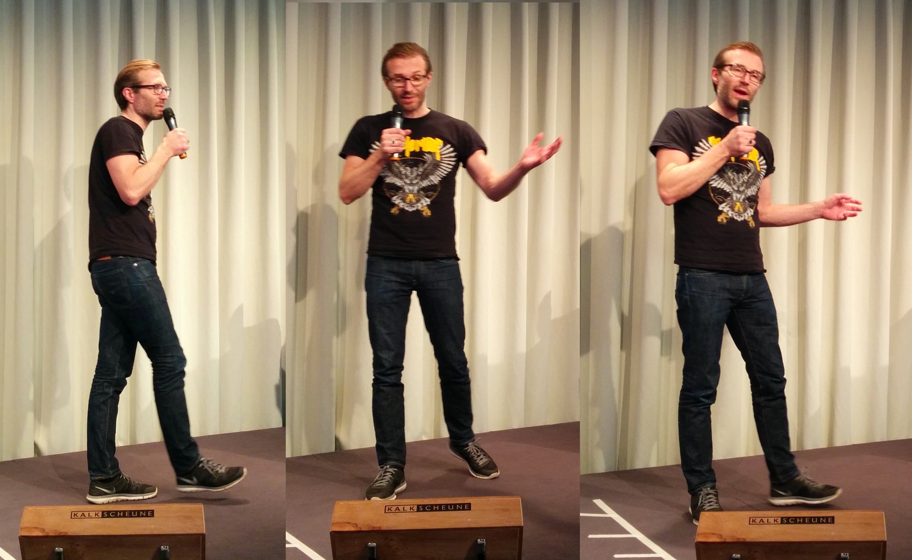

DevOpsDays Berlin 2015
======================

**DevOpsDays er en av de viktigste konferansene som fokuserer på DevOps. Konferansen arrangeres mange ganger årlig på mange steder spredt over hele verden. Med BEKKs fokus på DevOps var det naturlig at vi var tilstede da konferansen nylig ble arrangert i Berlin.**

Konferansen går over to dager og har et format som er litt ulikt mange andre konferanser. Forskjellen ligger i at siste halvdel av begge dagene består av [Open Spaces](https://en.wikipedia.org/wiki/Open_Space_Technology), lignende [Smidig](http://smidig.no) her til lands.

Første halvdel av dagene besto av halvtimers foredrag i plenum. Mellom foredragene og open space ble det holdt en rekke _ignite talks_. Parallelt med open space var det også et track med _hands-on presentasjoner_. 

## Hva ble det pratet om?

Konferansen hadde en god blanding av «myke» og «harde» foredrag. Av de harde gikk det ikke overraskende mye i provisjoneringsrammeverk (spesielt Ansible) og container-teknologi (type Docker). Særlig blant sistnevnte er det fremdeles mye hype ute å går.

Blant de klart bedre foredragene står [DevOoops (Increase awareness around DevOps infra security)](https://drive.google.com/file/d/0ByJ_TRRQFrRUc0tocnRTMW1aT2c/view) av Gianluca Varisco. Han pratet om klassiske sikkerhetsfeller man kan gå i der typiske DevOpsverktøy er involvert. Både Git, Vagrant og Docker ble nevnt. Absolutt verdt å se over!

I [WARNING is a waste of my time](https://drive.google.com/file/d/0BwE6Lg9fMpezVU9mOG9ZRG8tMTA/view) snakket Schlomo Schapiro om hvorfor det er latskap å logge ting som `warning`. Rasjonalet ligger i at det er vanskelig å bygge automatisering rundt en hendelse som kanskje er OK og kanskje ikke.

Noen foredrag var også av mykere art, noe som bare skulle mangle på en konferanse om DevOps. [Keynoten av John Willis](https://vimeo.com/146217875) handlet om _Improvement kata_. I [Power in the workplace and women in tech](https://vimeo.com/146217876) pratet Inga Höltmann om hvordan makt fungerer på en arbeidsplass, hva som skiller sjefer fra ledere, og hva som kjennetegner en god leder.

## Ignite talks

Formatet for ignite talk er et ganske utfordrende et. Når det fungerer kan det bli ganske bra, men det kan samtidig feile grusomt med mindre foredragsholderen er erfaren eller er svært godt forberedt.

Foredraget varer i 5 minutter, hverken mer eller mindre. Foredragsholderen har forberedt 20 slides, og disse bytter med 15 sekunds mellomrom uten at foredragsholderen har mulighet til å styre dette. Dette medfører naturligvis at foredraget må være godt innøvd og med korte konsise poenger, noe som kanskje ikke var tilfellet for alle som presenterte i Berlin.

Første dag på konferansen viste det seg at flere av ignite speaker-ene var blitt syke, så arrangørene etterspurte nye ignite speakers. En av dem som tok utfordringen på strak arm var vår egen Stein Inge Morisbak. Han pratet om hvorfor IT-prosjekter er en dårlig idé og hvorfor man heller burde bruke linja til å utvikle produkter. En utvidet versjon av samme foredrag ble for øvrig holdt som [lyntale på Smidigkonferansen](https://vimeo.com/145015970).

## Hands-on presentations

Hands-on presentasjoner skal være sesjoner som er mer kodenære og praktiske. Organisatorene hadde ikke informert særlig godt i forkant om hva de ønsket, og det er dermed ikke overaskende at disse sesjonene kom i litt forskjellige formater. Mange av sesjonene ble arrangert på linje med en open space, men med noen slides og en intro. Andre hadde forberedt innhold mer i retning av foredrag, dog naturligvis med mye kode på slidene.

BEKK hadde bidrag også av denne typen. Sveinung Dalatun og Kjetil Valle holdt et foredrag om hvordan provisjonering av servere gjøres i javaBin, og spesielt med fokus på systemene som driver JavaZone. Dette foredraget ble dessverre ikke filmet, men en tidligere utgave av foredraget fra fjorårets JavaZone er [tilgjengelig på video](https://vimeo.com/105861377).

## DevOps "Certified"

Under innledende sesjoner på konferansen ble det gjort narr av at alt mulig skal sertifiseres – nå også DevOps. Konferansen tilbydde derfor sertifiseringer for alle som ønsket seg dette. Disse kunne fritt hentes i resepsjonen, helt gratis.

## PS: DevOpsDays Oslo 2016

I 2016 trenger du ikke lenger reise ut av Oslo for å delta på konferansen. Da er planen nemlig å arrangere DevOpsDays i Oslo for første gang. For å få det til trenger vi flere som ønsker å bidra. Les mer om [hva slags folk vi ser etter](http://www.meetup.com/DevOps-Norway/events/227099264/) hvis du kunne tenke deg å være med. 

Vi gleder oss allerede!
